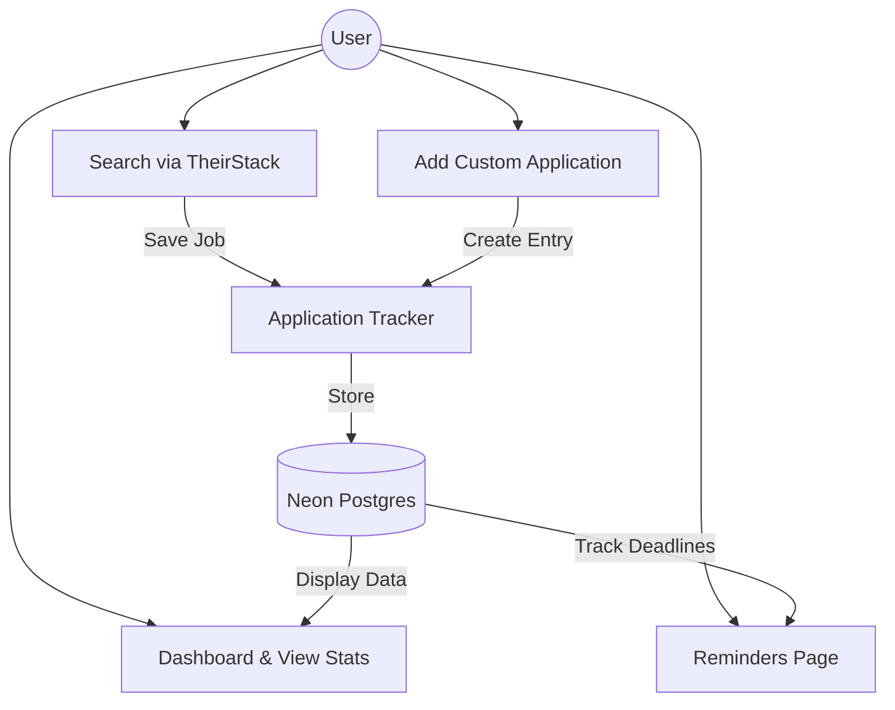

# NexLink

<p align="left">
  
  
  

  
</p>

[](https://nexlink-dashboard.vercel.app)

A trusted platform that helps students and early-career professionals move from education to employment through structured internship discovery, preparation, and community support.

[**Visit Nexlink »**](https://nexlink-dashboard.vercel.app)

---

## Project Overview

### The Problem

Many undergraduates and graduates struggle to:

- **Track** internship applications across multiple platforms.
- **Verify** if internships are legit, open, or closed.
- **Prepare** competitive CVs and understand industry-specific interview expectations.
- **Access** mentorship and a community that shares real-time internship insights.

### Vision

To empower undergraduates, graduates, and career switchers with a single platform to track internships, prepare professionally, learn from peers, and gain mentorship — so no opportunity is missed due to poor visibility or lack of guidance.

---

## Key Features

### Tracking & Community

- **Internship Application Tracker:** Manage application status (Saved, Applied, Interview, Offer, Rejected).
- **Search Functionality:** Search internships with filters for industry, location (Country, City, Remote/Hybrid), and **Visa Sponsorship**.
- **Community Hub:** Company-specific interview threads, and a Q&A forum with an upvote/flag system.
- **CV & Career Prep:** CV uploads, peer reviews, and an interview preparation library.

---

## Tech Stack

| Layer              | Technology                                      |
| :----------------- | :---------------------------------------------- |
| **Framework**      | [Next.js 13+ (App Router)](https://nextjs.org/) |
| **Language**       | [TypeScript](https://www.typescriptlang.org/)   |
| **Backend**        | [Node.js](https://nodejs.org/)                  |
| **Database**       | [Neon Postgres](https://neon.tech/)             |
| **ORM**            | [Prisma](https://www.prisma.io/)                |
| **Authentication** | [ClerkJS](https://clerk.com/)                   |
| **Deployment**     | [Vercel](https://vercel.com/)                   |

---

## System Architecture

The following diagram illustrates the architectural flow of NexLink.



---

## Local Setup

1.  **Clone & Install:**

    Visit the repo here: [https://github.com/chingu-voyages/V59-tier3-team-31](https://github.com/chingu-voyages/V59-tier3-team-31)

    ```
    git clone https://github.com/chingu-voyages/V59-tier3-team-31.git
    cd nexlink
    npm install

    ```

2.  **Environment Variables:** Create a `.env.local` file and add:
    - `DATABASE_URL` (From Neon)

    - `DIRECT_URL` (From Neon)

    - `NEXT_PUBLIC_CLERK_PUBLISHABLE_KEY`
    - `CLERK_SECRET_KEY`

    - `NEXT_PUBLIC_CLERK_AFTER_SIGN_IN_URL=/`

    - `NEXT_PUBLIC_CLERK_AFTER_SIGN_UP_URL=/`
    - `THEIRSTACK_API_KEY`

    - `RESEND_API_KEY`= (From Resend)

    - `EMAIL_FROM`= NexLink <onboarding@resend.dev>

    - `CRON_SECRET`= (Create a random string to secure your cron routes)

3.  **Database Sync:**

    ```
    npx prisma db push

    ```

4.  **Run Development Server:**

    ```
    npm run dev
    ```

---

## Created By

This project was envisioned and developed by the **Nexlink Team** as part of **Voyage 59** of the [**Chingu**](https://www.chingu.io/) Voyage.

| Name                     | Role          | Links                                                                                                        |
| :----------------------- | :------------ | :----------------------------------------------------------------------------------------------------------- |
| **Tunde Ademola Kujore** | Product Owner | [GitHub](https://github.com/Dhemmyhardy) / [LinkedIn](https://www.linkedin.com/in/tundeademolakujore)        |
| **Daniel Kwame Afriyie** | Scrum Master  | [GitHub](https://github.com/dk-afriyie) / [LinkedIn](http://www.linkedin.com/in/danielkafriyie)              |
| **Ken Jervis Reyes**     | Web Developer | [GitHub](https://github.com/KingNoran) / [LinkedIn](https://www.linkedin.com/in/ken-jervis-reyes-20958227b/) |
| **Pratyusha Dasari**     | Web Developer | [GitHub](https://github.com/pratyusha-ds) / [LinkedIn](https://www.linkedin.com/in/pratyusha-ds/)            |
| **Emmanuel Ungab**       | Web Developer | [GitHub](https://github.com/jeru7) / [LinkedIn](https://www.linkedin.com/in/jeru7/)                          |
